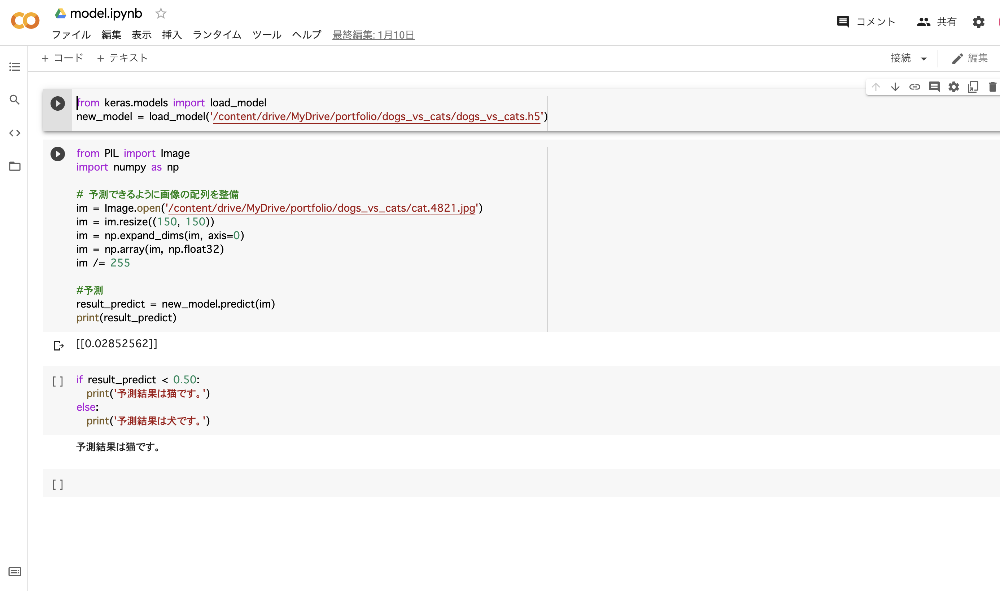
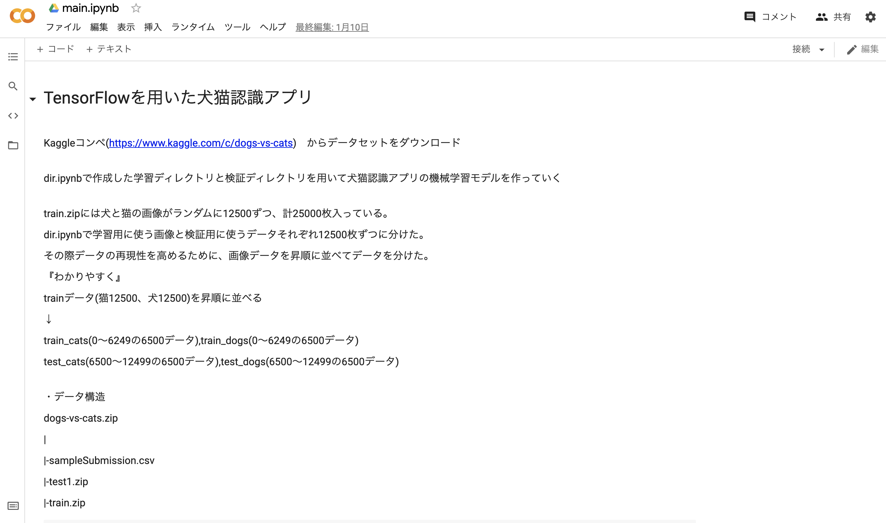
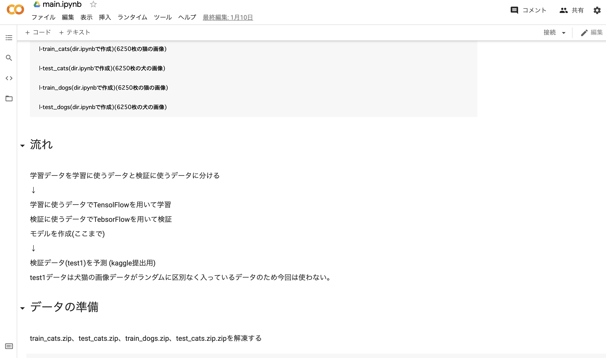
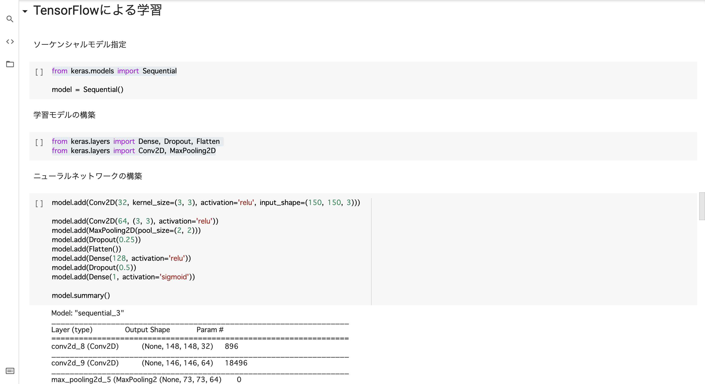

# Name
 
1.TensorFlowを用いた犬猫認識アプリ
  
  
  


 
# Features

dir.ipynb  
Kaggleコンペ(https://www.kaggle.com/c/dogs-vs-cats)　
からデータセットをダウンロードして、学習用(train.zip)、検証用(test.zip)に分けるファイル  

main.ipynb  
dir.ipynbで作成したデータセットを用いてTensorFlowで学習および検証するファイル  

model.ipynb  
main.ipynbで作成した学習モデルを用いて実際に犬猫を認識するファイル  

# Points

* データ整形  

kaggleデータセットは犬猫の画像がランダムに入っているため、dir.ipynbで画像を昇順に並べ、フォルダを作り、再現性を高めた。  
TensorFlowに学習させるために画像を整形した。

* TensorFlowを用いたディープラーニング  

基本的なディープラーニングの知識、二値分類で学習させたこと。
 
# 実行環境

Google Colaboratory(ランタイムのタイプ:GPUに設定)

Google Colaboratoryのリンク
https://drive.google.com/drive/folders/1QnUMQJnTnlJ1PN6Ct4tj2sKsi7_6Yhbo?usp=sharing

# 注意

dir.ipynbおよびmain.ipynbを実行すると処理が重くなるので、作成したモデルoriginal_dogs_cats.h5ファイルを用いていただけたら幸いです。

演算処理性能の高いGoogle ColaboratoryのGPUを用いました。

original_dogs_cats.h5ファイル、trainファイル、testファイルのサイズが大きいためgithubにpushできなかった。  
そのため、Google Colaboratoryを参照していただきたい。


# Requirement
 
"main.ipyb "を動かすのに必要なライブラリ  

```bash
import matplotlib.pyplot as plt
import numpy as np
import tensorflow as tf
import keras
from PIL import Image
from keras.preprocessing.image import ImageDataGenerator
from keras.models import Sequential
from keras.layers import Dense, Dropout, Flatten
from keras.layers import Conv2D, MaxPooling2D
import matplotlib.pyplot as plt
```  

# Installation
 
Requirementで列挙したライブラリなどのインストール方法
 
```bash
pip install numpy  
etc
```
 
# Usage
 
"model.ipyb"の基本的な使い方
 
```bash
git clone https://github.com/tanimoyan/dogs-vs-cats.git  
python3 diabetes.ipyb  
```
 
# Author
 
* tanimoto